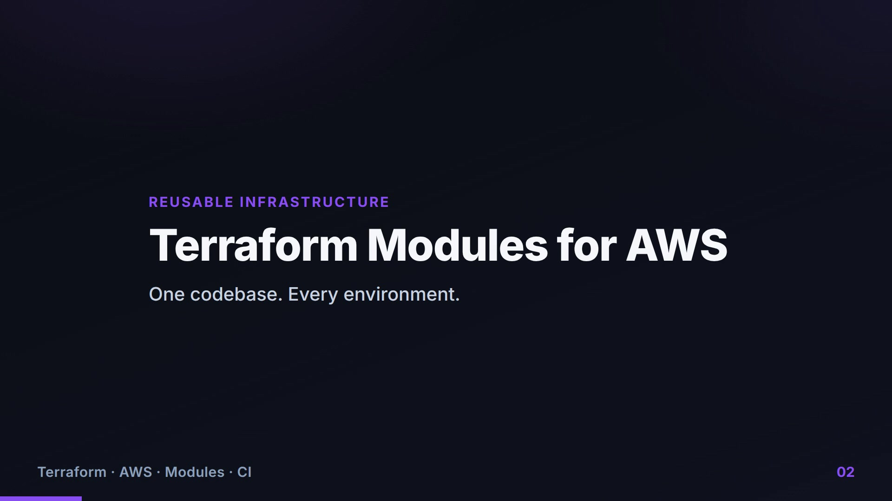
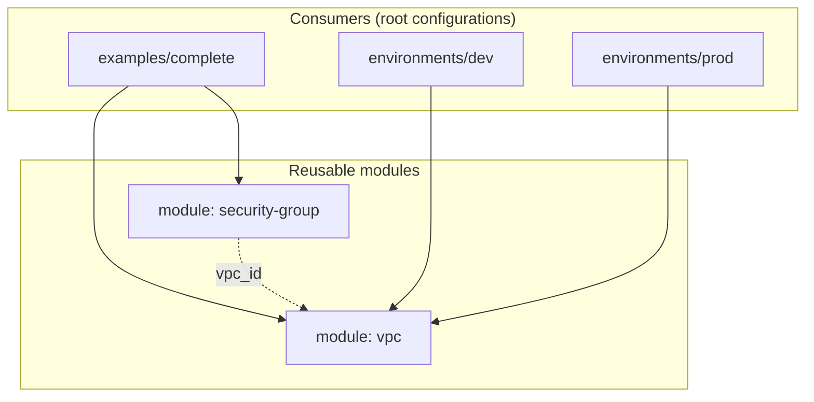

<div align="center">

# Reusable Terraform Modules for AWS

**A composable module library that builds the *same* AWS network cheaply for development and highly-available for production — from one codebase, with no copy-paste.**

[](https://www.terraform.io/)
[](https://aws.amazon.com/)
[](#modules)
[](.github/workflows/terraform.yml)

<br/>

### 🎬 24-second explainer

[](media/explainer.mp4)

*Click the image to play the video.*

</div>

---

## The Problem

The fastest way to rot an infrastructure codebase is copy-paste. Teams duplicate the same
VPC and security-group blocks into `dev`, `staging`, and `prod`, the copies drift apart, and
a fix in one environment silently never reaches the others.

The professional answer is **modules**: write a building block once, give it a clean
interface, and let every environment consume it with different inputs. This repository is
that answer, built as a small, production-style module library.

## What It Does

It packages two reusable Terraform modules and proves their value by composition:

- **`vpc`** — a parameterised network (public/private subnets across AZs, Internet Gateway, optional NAT).
- **`security-group`** — a single rule-driven module that builds *any* tier's firewall from a list of rules.

Then three consumers use them: a complete worked **example**, a cost-optimised **dev**
environment, and a highly-available **prod** environment — all calling the *same* module code.

## Module Composition



## The Headline: One Module, Two Environments

This is the whole point of the project — identical module code, different inputs, consistent
results:

```hcl
# environments/dev — cost-optimised
module "vpc" {
  source             = "../../modules/vpc"
  azs                = ["ap-south-1a", "ap-south-1b"]
  single_nat_gateway = true     # one shared NAT Gateway (cheaper)
}

# environments/prod — highly available
module "vpc" {
  source             = "../../modules/vpc"
  azs                = ["ap-south-1a", "ap-south-1b", "ap-south-1c"]
  single_nat_gateway = false    # one NAT Gateway per AZ (no single point of failure)
}
```

No duplicated resources. Change the module once and every environment inherits the fix.

## Key Engineering Decisions

| Decision | Why it was made |
|----------|-----------------|
| **Thin, single-purpose modules** | Small modules with narrow interfaces compose cleanly and are easy to reason about, test, and version — the opposite of one giant "do-everything" module. |
| **One rule-driven security-group module** | Instead of separate `alb-sg` / `app-sg` / `db-sg` modules, a single module takes an `ingress_rules` list, so there is zero rule-block duplication. |
| **Typed inputs with `optional()` attributes & validation** | The interface is self-documenting and rejects bad input at plan time, before anything is created. |
| **Optional, toggleable NAT** | `enable_nat_gateway` / `single_nat_gateway` let the same module serve a cheap dev VPC and an HA prod VPC; routing adapts automatically. |
| **Provider requirements inside each module** | Each module declares its own `required_providers`, so it can be validated and published independently. |
| **Validation wired into CI** | Every push runs `fmt` and `validate` across all modules and configs, so a broken module can't merge unnoticed. |

## Modules

| Module | Purpose | Documentation |
|--------|---------|---------------|
| [`modules/vpc`](modules/vpc) | VPC with public/private subnets across AZs, Internet Gateway, and optional NAT (single or per-AZ) | [README](modules/vpc/README.md) |
| [`modules/security-group`](modules/security-group) | A single security group built from a list of rules — serves any tier (ALB, app, database) | [README](modules/security-group/README.md) |

## Repository Structure

```text
.
├── modules/
│   ├── vpc/                  # VPC, subnets, IGW, NAT, routing
│   └── security-group/       # rule-driven security group
├── examples/
│   └── complete/             # composes both modules into a two-tier network
│       └── tests/            # native terraform test
├── environments/
│   ├── dev/                  # 2 AZs, single NAT
│   └── prod/                 # 3 AZs, NAT per AZ
├── .github/workflows/        # CI: fmt + validate
└── docs/                     # architecture diagram and implementation notes
```

## Getting Started

```bash
git clone https://github.com/deba310984/aws-terraform-modules
cd aws-terraform-modules/examples/complete

terraform init
terraform validate
terraform plan            # preview — nothing is created
terraform apply           # provisions AWS resources (NAT Gateway is billable)
terraform test            # plan-time assertions
terraform destroy         # tear down to stop charges
```

`plan`, `apply`, and `test` require AWS credentials; `fmt` and `validate` run offline once
the provider is downloaded.

## Quality & CI

Every push and pull request runs the [Terraform workflow](.github/workflows/terraform.yml),
which is **passing**:

- `terraform fmt -check -recursive` — formatting gate.
- `terraform validate` on each module and configuration (via `init -backend=false`).
- `examples/complete/tests/plan.tftest.hcl` — native test asserting subnet counts and security-group wiring.

See the [implementation notes](docs/implementation-notes.md) for design decisions, module
versioning, and remote-state guidance.

## Cost Note

The modules themselves cost nothing. Applying the example or environments creates a **NAT
Gateway** (not free-tier, roughly `$0.045/hr` plus data) and an Elastic IP. Run
`terraform destroy` when finished.

## What This Demonstrates

- **Designing reusable abstractions** — clean module interfaces, not copy-pasted resources.
- **DRY, multi-environment infrastructure** — the same code safely driving dev and prod.
- **Terraform depth** — typed variables, `optional()` object attributes, validation, outputs, `terraform test`.
- **AWS networking** — VPCs, subnets, NAT strategy, and security-group composition.
- **Infrastructure quality engineering** — CI validation, versioning, and remote-state awareness.
