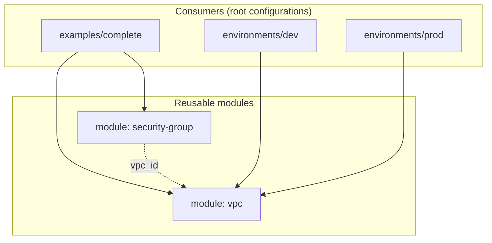

<div align="center">

# Reusable Terraform Modules for AWS

**A small, composable module library — build the same network cheaply for development and highly-available for production from one codebase.**

[](https://www.terraform.io/)
[](https://aws.amazon.com/)
[](#modules)
[](.github/workflows/terraform.yml)

</div>

---

## Overview

Copy-pasting networking and security-group blocks into every environment is how
infrastructure code rots. This repository packages the common building blocks as
**reusable Terraform modules** with clear input/output interfaces, then demonstrates the
same modules producing a cost-optimised **development** network and a highly-available
**production** network — with no duplicated resource code.

The emphasis is on module design: thin, single-purpose modules; typed and validated
inputs; composition over repetition; and continuous validation in CI.

## Module Composition



## Highlights

- **Composable modules** — a `vpc` module and a rule-driven `security-group` module, each doing one job well.
- **DRY environments** — `dev` (2 AZs, single NAT) and `prod` (3 AZs, one NAT per AZ) consume the *same* `vpc` module with different inputs.
- **Clean interfaces** — typed variables with `optional()` object attributes, input validation, and documented outputs.
- **Continuously validated** — GitHub Actions runs `terraform fmt -check` and `terraform validate` on every module and configuration.
- **Tested** — a native `terraform test` asserts the composed example's shape (subnet counts, security-group wiring).
- **Secure by default** — state and secrets are gitignored; tier trust is expressed by security-group reference, not by IP.

## Modules

| Module | Purpose | Documentation |
|--------|---------|---------------|
| [`modules/vpc`](modules/vpc) | VPC with public/private subnets across AZs, Internet Gateway, and optional NAT (single or per-AZ) | [README](modules/vpc/README.md) |
| [`modules/security-group`](modules/security-group) | A single security group built from a list of rules — serves any tier (ALB, app, database) | [README](modules/security-group/README.md) |

## One Module, Two Environments

The same module code produces differently-sized, consistent stacks:

```hcl
# environments/dev — cost-optimised
module "vpc" {
  source             = "../../modules/vpc"
  azs                = ["ap-south-1a", "ap-south-1b"]
  single_nat_gateway = true     # one shared NAT Gateway
}

# environments/prod — highly available
module "vpc" {
  source             = "../../modules/vpc"
  azs                = ["ap-south-1a", "ap-south-1b", "ap-south-1c"]
  single_nat_gateway = false    # one NAT Gateway per AZ
}
```

## Repository Structure

```text
.
├── modules/
│   ├── vpc/                  # VPC, subnets, IGW, NAT, routing
│   └── security-group/       # rule-driven security group
├── examples/
│   └── complete/             # composes both modules into a two-tier network
│       └── tests/            # native terraform test
├── environments/
│   ├── dev/                  # 2 AZs, single NAT
│   └── prod/                 # 3 AZs, NAT per AZ
├── .github/workflows/        # CI: fmt + validate
└── docs/                     # architecture diagram and implementation notes
```

## Getting Started

```bash
git clone https://github.com/deba310984/aws-terraform-modules
cd aws-terraform-modules/examples/complete

terraform init
terraform validate
terraform plan            # preview — nothing is created
terraform apply           # provisions AWS resources (NAT Gateway is billable)
terraform test            # plan-time assertions
terraform destroy         # tear down to stop charges
```

`plan`, `apply`, and `test` require AWS credentials; `fmt` and `validate` run offline once
the provider is downloaded.

## Quality & CI

Every push and pull request runs the [Terraform workflow](.github/workflows/terraform.yml):

- `terraform fmt -check -recursive` — formatting gate.
- `terraform validate` on each module and configuration (via `init -backend=false`).
- `examples/complete/tests/plan.tftest.hcl` — native test (run locally with `terraform test`).

See the [implementation notes](docs/implementation-notes.md) for design decisions, module
versioning, and remote-state guidance.

## Cost Note

The modules themselves cost nothing. Applying the example or environments creates a **NAT
Gateway** (not free-tier, roughly `$0.045/hr` plus data) and an Elastic IP. Run
`terraform destroy` when finished.

## Skills Demonstrated

Terraform module design · module interfaces (variables/outputs) · typed variables &
validation · DRY multi-environment infrastructure · AWS VPC networking · security groups ·
CI for infrastructure as code · `terraform test` · remote state & module versioning.
