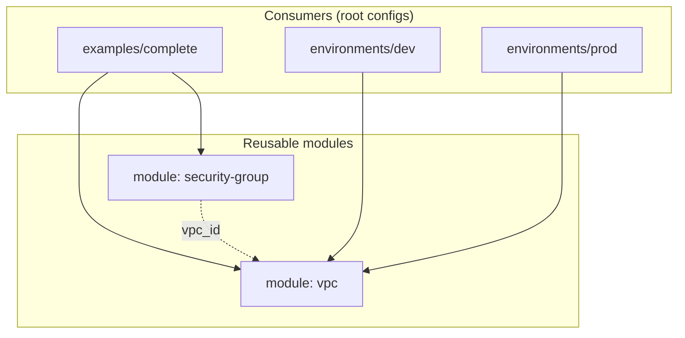

<div align="center">

# 🧩 Reusable Terraform Modules for AWS

### A small, composable module library — build the same network cheaply for dev and highly-available for prod from one codebase

[](https://www.terraform.io/)
[](https://aws.amazon.com/)
[](#modules)
[](.github/workflows/terraform.yml)

**Thin, documented modules** · **input/output interfaces** · **dev vs prod from the same code** · **CI-validated**

</div>

---

## 🎯 Overview

Copy-pasting VPC and security-group blocks into every environment is how
infrastructure code rots. This repository packages the common building blocks
as **reusable Terraform modules** with clear interfaces, then shows the same
modules producing a **cheap dev** network and a **highly-available prod**
network — no duplicated resource code.

- 🧩 **Composable modules** — `vpc` and a rule-driven `security-group`, each doing one job well
- ♻️ **DRY environments** — `dev` (2 AZs, 1 NAT) and `prod` (3 AZs, 1 NAT per AZ) call the *same* module
- 🔌 **Clean interfaces** — typed variables (with `optional()` object attributes), validation, and outputs
- ✅ **CI-validated** — GitHub Actions runs `terraform fmt -check` and `validate` on every module and config
- 🧪 **Tested** — a native `terraform test` asserts the composed example's shape
- 🔐 **Safe by default** — secrets and state are gitignored; SG trust is expressed by security-group reference, not IP

## 🗺️ Module composition



## 🧩 Modules

| Module | Purpose | Docs |
|--------|---------|------|
| **`modules/vpc`** | VPC with public/private subnets across AZs, IGW, optional NAT | [README](modules/vpc/README.md) |
| **`modules/security-group`** | One SG from a list of rules — builds any tier (ALB/app/DB) | [README](modules/security-group/README.md) |

## ♻️ Same module, two environments

```hcl
# environments/dev  — cheap
module "vpc" {
  source             = "../../modules/vpc"
  azs                = ["ap-south-1a", "ap-south-1b"]
  single_nat_gateway = true     # one shared NAT
  # ...
}

# environments/prod — highly available
module "vpc" {
  source             = "../../modules/vpc"
  azs                = ["ap-south-1a", "ap-south-1b", "ap-south-1c"]
  single_nat_gateway = false    # one NAT per AZ
  # ...
}
```

## 📂 Repository structure
```text
.
├── modules/
│   ├── vpc/                  # VPC, subnets, IGW, NAT, routes
│   └── security-group/       # rule-driven security group
├── examples/
│   └── complete/             # wires both modules into a two-tier network
│       └── tests/            # native `terraform test`
├── environments/
│   ├── dev/                  # 2 AZs, single NAT
│   └── prod/                 # 3 AZs, NAT per AZ
├── .github/workflows/        # CI: fmt + validate
└── docs/                     # architecture + implementation notes
```

## 🚀 Quick start

```bash
git clone https://github.com/deba310984/aws-terraform-modules
cd aws-terraform-modules/examples/complete

terraform init
terraform fmt -check -recursive
terraform validate
terraform plan            # preview — nothing created
terraform apply           # creates AWS resources (paid: NAT Gateway)
terraform test            # plan-time assertions
terraform destroy         # tear down to stop charges
```

> `plan`/`apply`/`test` need AWS credentials. `fmt`/`validate` run offline once
> `init` has downloaded the provider.

## 🧪 Quality & CI

- `terraform fmt -check -recursive` — formatting gate
- `terraform validate` on every module and configuration (via `init -backend=false`)
- `examples/complete/tests/plan.tftest.hcl` — native test asserting subnet counts and SG wiring
- All of the above run in [GitHub Actions](.github/workflows/terraform.yml) on push and PR

## 💰 Cost note
The modules themselves cost nothing. Applying the example/environments creates a
**NAT Gateway** (not free-tier, ~$0.045/hr + data) and an Elastic IP. Run
`terraform destroy` when finished.

## 💡 Skills demonstrated

`Terraform modules` · `module interfaces (variables/outputs)` · `typed variables & validation` · `DRY multi-environment design` · `AWS VPC networking` · `security groups` · `CI for IaC` · `terraform test` · `remote state & module versioning (documented)`

## 📚 More
- [Implementation notes & design decisions](docs/implementation-notes.md)
- [VPC module](modules/vpc/README.md) · [Security-group module](modules/security-group/README.md)
